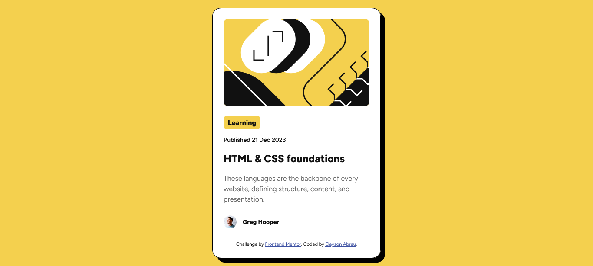

# Frontend Mentor - Blog preview card solution

This is a solution to the [Blog preview card challenge on Frontend Mentor](https://www.frontendmentor.io/challenges/blog-preview-card-ckPaj01IcS). Frontend Mentor challenges help you improve your coding skills by building realistic projects. 

## Table of contents

- [Overview](#overview)
  - [The challenge](#the-challenge)
  - [Screenshot](#screenshot)
  - [Links](#links)
- [My process](#my-process)
  - [Built with](#built-with)
  - [What I learned](#what-i-learned)
  - [Continued development](#continued-development)
  - [Useful resources](#useful-resources)
- [Author](#author)
- [Acknowledgments](#acknowledgments)

## Overview

### The challenge

Users should be able to:

- See hover and focus states for all interactive elements on the page

### Screenshot

### Links

- Live Site URL: [Add live site URL here](https://your-live-site-url.com)

## My process

### Built with

- Semantic HTML5 markup
- CSS custom properties
- CSS Grid

### What I learned

It is possible to add shadow to the container using `box-shadow`.

### Continued development

I used `vertical-align` in this project, but I assigned it an absolute value. I would have preferred to have found a way to insert a predefined value like `middle`, but the result was incomprehensible. So I need to understand this property better.

### Useful resources

- [ChatGPT](https://openai.com/chatgpt/) - It taught me how to use the `box-shadow` property.
- [Community feedback](https://www.frontendmentor.io/solutions/social-links-profile-using-css-lOFIHhT9gz) - In my previous challenge, user `MikDra1` posted a code that can be used to center elements vertically. I used his code in this challenge.

## Author

- Frontend Mentor - [@ElaysonAbreu](https://www.frontendmentor.io/profile/ElaysonAbreu)

## Acknowledgments

I would like to thank a user in my [Community feedback](https://www.frontendmentor.io/solutions/social-links-profile-using-css-lOFIHhT9gz) tab who taught me a way to center containers vertically.